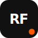

#  ReactField

ReactField is a field guide to production React, focused on opinionated best practices, architecture decisions, and practical ecosystem guidance for real-world teams.

## Why ReactField?

- Learn patterns that scale beyond small demos.
- Understand trade-offs behind tooling and architecture decisions.
- Explore practical guidance you can apply directly in production apps.

## Tech Stack

- Next.js
- React
- MDX content system
- Tailwind CSS

## Getting Started

```bash
npm install
npm run dev
```

Open [http://localhost:3000](http://localhost:3000) to view the site.

## Available Scripts

- `npm run dev` - Start the local development server.
- `npm run build` - Build for production.
- `npm run start` - Run the production build locally.
- `npm run lint` - Run ESLint checks.

## Contributing

Ideas and improvements are welcome.

- Open an issue with the `Question` label to start a discussion.
- Pick a task from [good first issues](https://github.com/MhamedEl-shahawy/ReactField/labels/good%20first%20issue).
- Fork the repository and open pull requests against `develop`.

## Maintainer

Maintained by [Mohamed Elshahawy](https://github.com/MhamedEl-shahawy).
